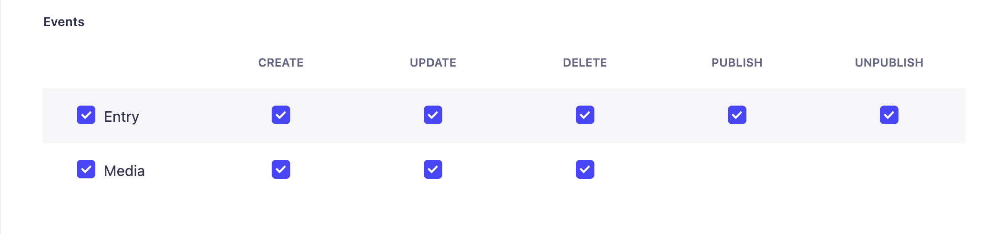

# gatsby-source-strapi

Source plugin for pulling documents into Gatsby from a Strapi API.

> ⚠️ This version of `gatsby-source-strapi` is only compatible with Strapi v4. For v3 use this [release](https://www.npmjs.com/package/gatsby-source-strapi/v/1.0.3)

<details>
<summary><strong>Table of contents</strong></summary>

- [gatsby-source-strapi](#gatsby-source-strapi)
  - [Installing the plugin](#installing-the-plugin)
    - [Using yarn](#using-yarn)
    - [Or using NPM](#or-using-npm)
  - [Setting up the plugin](#setting-up-the-plugin)
    - [Basic usage](#basic-usage)
    - [Advanced usage](#advanced-usage)
      - [Deep queries populate](#deep-queries-populate)
      - [Draft content](#draft-content)
      - [Image optimisation](#image-optimisation)
      - [Rich text field](#rich-text-field)
      - [Components](#components)
      - [Dynamic zones](#dynamic-zones)
      - [Internationalization](#internationalization)
  - [Gatsby cloud and preview environment setup](#gatsby-cloud-and-preview-environment-setup)
    - [Setup](#setup)
    - [Enabling Content Sync](#enabling-content-sync)
      - [Installing the @strapi/plugin-gatsby-preview](#installing-the-strapiplugin-gatsby-preview)
        - [Using yarn](#using-yarn-1)
        - [Using npm](#using-npm)
      - [Configurations](#configurations)
  - [Restrictions and limitations](#restrictions-and-limitations)

</details>

## Installing the plugin

### Using yarn

```sh
yarn add gatsby-source-strapi gatsby-plugin-image gatsby-plugin-sharp gatsby-source-filesystem gatsby-transformer-remark gatsby-transformer-sharp
```

### Or using NPM

```sh
npm install --save gatsby-source-strapi gatsby-plugin-image gatsby-plugin-sharp gatsby-source-filesystem gatsby-transformer-remark gatsby-transformer-sharp
```

## Setting up the plugin

You can enable and configure this plugin in your `gatsby-config.js` file.

### Basic usage

First, you need to configure the `STRAPI_API_URL` and the `STRAPI_TOKEN` environment variables. We recommend using [`dotenv`](https://github.com/motdotla/dotenv) to expose these variables.

Make sure to create a full-access [API token](https://docs.strapi.io/developer-docs/latest/setup-deployment-guides/configurations/optional/api-tokens.html) in Strapi.

**Path:** `./.env.development`

```sh
STRAPI_API_URL=http://localhost:1337
STRAPI_TOKEN=<my-development-api-token-for-gatsby>
```

**Path:** `./gatsby.config.js`

```javascript
require('dotenv').config({
  path: `.env.${process.env.NODE_ENV}`,
});

const strapiConfig = {
  apiURL: process.env.STRAPI_API_URL,
  accessToken: process.env.STRAPI_TOKEN,
  collectionTypes: ['article', 'company', 'author'],
  singleTypes: [],
};

module.exports = {
  plugins: [
    {
      resolve: `gatsby-source-strapi`,
      options: strapiConfig,
    },
  ],
};
```

### Advanced usage

#### Deep queries populate

```javascript
const strapiConfig = {
  // ...
  collectionTypes: [
    {
      singularName: 'article',
      queryParams: {
        // Populate media and relations
        // Make sure to not specify the fields key so the api always returns the updatedAt
        populate: {
          image: '*',
          images: '*',
          author: {
            populate: {
              avatar: '*',
              company: {
                populate: {
                  image: '*',
                },
              },
            },
          },
        },
      },
    },
  ],
  // ...
};
```

#### Draft content

Strapi now supports [Draft and publish](https://strapi.io/documentation/developer-docs/latest/concepts/draft-and-publish.html#draft-and-publish), which allows you to save your content as a draft and publish it later. By default, this plugin will only fetch the published content.

Draft content should only be pulled when previewing content in the Gatsby preview environment to enable the preview you need to fetch content only when the `GATSBY_IS_PREVIEW` environment variable is truthy.

Refer to the [Gatsby cloud and preview environment setup](#gatsby-cloud-and-preview-environment-setup) section to see how to set it up.

**Path:** `./gatsby.config.js`

```javascript
const strapiConfig = {
  // ...
  collectionTypes: [
    {
      singularName: 'article',
      queryParams: {
        publicationState: process.env.GATSBY_IS_PREVIEW === 'true' ? 'preview' : 'live',
        populate: {
          category: { populate: '*' },
          cover: '*',
          blocks: {
            populate: '*',
          },
        },
      },
    },
  ],
  // ...
};
```

Then in your GraphQL query you should be able to display published content by using the following query:

```graphql
{
  allStrapiArticle(filter: { publishedAt: { ne: null } }) {
    nodes {
      id
    }
  }
}
`
```

#### Image optimisation

By default all medias are downloaded in the Gatsby file system.
To query your asset use the following query:

```graphql
{
  allStrapiArticle {
    nodes {
      cover {
        localFile {
          childImageSharp {
            gatsbyImageData
          }
        }
      }
    }
  }
}
```

#### Rich text field

Rich text fields can now be processed using the [`gatsby-transformer-remark`](https://www.gatsbyjs.com/plugins/gatsby-transformer-remark/https://www.gatsbyjs.com/plugins/gatsby-transformer-remark/) plugin.

> It only works if the content of the rich text field saved in the database is in markdown format. So if you customized the WYSIWYG in your Strapi Administration panel make sure that it is saved in a markdown format.

Files that are added in the richtext field can now also be processed by the [`gatsby-plugin-image`](https://www.gatsbyjs.com/plugins/gatsby-plugin-image/?=gatsby-plugin-i#gatsby-plugin-image) plugin.

To do so, according the [restrictons and limitations of the plugin](#restrictions-and-limitations) you need to make sure that at least one of your content types entities has a file uploaded in the richtext field.

To query markdown local fields use the following query:

```graphql
{
  allStrapiArticle {
    nodes {
      # richtext field content
      body {
        # object to access the markdown node
        data {
          # unprocessed data from Strapi
          body
          # processed markdown
          childMarkdownRemark {
            html
            rawMarkdownBody
          }
        }
        # files from the markdown that are processed using the gatsby-image-plugin
        medias {
          # alternative text saved in the markdown
          alternativeText
          # file from the media library
          file {
            # alternative text of the file in the media library
            # it can be different from the one set in your markdown
            alternativeText
          }
          # file processed with gatsby-plugin-image
          localFile {
            childImageSharp {
              gatsbyImageData
            }
          }
          # src set in your markdown field (ex: [alternativeText](src))
          src
          # prefixed url with the Strapi api endpoint of the file
          # when using a provider the src field value is equal to the url field value
          url
        }
      }
    }
  }
}
```

#### Components

Strapi components creates unique Gatsby nodes to be able to query a single component in GraphQL using the Gatsby id.
To query a specific component use the following query:

```graphql
{
  strapiComponentSharedRichText(id: { eq: "id" }) {
    id
  }
}
```

#### Dynamic zones

To query dynamic zones, write a query using [inline GraphQL fragments](https://graphql.org/learn/queries/#inline-fragments).

You can use the following query:

```graphql
{
  allStrapiArticle {
    nodes {
      blocks {
        ... on STRAPI__COMPONENT_SHARED_RICH_TEXT {
          id
          # Since __component is forbidden in gatsby this field is prefixed by strapi_
          strapi_component
        }
        ... on STRAPI__COMPONENT_SHARED_QUOTE {
          id
          strapi_component
        }
        ... on STRAPI__COMPONENT_SHARED_MEDIA {
          id
          strapi_component
        }
        ... on STRAPI__COMPONENT_SHARED_SLIDER {
          id
          strapi_component
        }
      }
    }
  }
}
```

#### Internationalization

Content types in Strapi can be localized with the [i18n plugin](https://docs.strapi.io/developer-docs/latest/plugins/i18n.html). But by default, gatsby-source-strapi will only fetch data in the default locale of your Strapi app. To specify which locale should be fetched, an `i18n` object can be provided in the content type's `pluginOptions`. You can also set the locale to `all` to get all available localizations of a content type:

```javascript
const strapiConfig = {
  // ...
  collectionTypes: [
    {
      singularName: 'article',
      pluginOptions: {
        i18n: {
          locale: 'fr', // Only fetch a specific locale
        },
      },
    },
  ],
  singleTypes: [
    {
      singularName: 'global',
      pluginOptions: {
        i18n: {
          locale: 'all', // Fetch all localizations
        },
      },
    },
  ],
  // ...
};
```

Then use the one of the following queries to fetch a localized content type:

```graphql
{
  # Get content in all available localizations
  allStrapiGlobal {
    nodes {
      locale
    }
  }

  # Get a single type in a specific locale
  strapiGlobal(locale: {eq: "fr"}) {
    locale
  }

  # Get a collection type in a specific locale
  allStrapiArticle(filter: {locale: {eq: "fr"}}) {
    nodes {
      locale
    }
  }
}
```

## Gatsby cloud and preview environment setup

### Setup

To enable content sync in [Gatsby cloud](https://www.gatsbyjs.com/docs/how-to/previews-deploys-hosting/deploying-to-gatsby-cloud/) you need to create two webhooks in your Strapi project:

- [Build webhook](https://support.gatsbyjs.com/hc/en-us/articles/360052324394-Build-and-Preview-Webhooks)



- [Preview webhook](https://support.gatsbyjs.com/hc/en-us/articles/360052324394-Build-and-Preview-Webhooks)

At this point each time you create an entry the webhooks will trigger a new build a deploy your new Gatsby site.

In the Site settings, Environment variables fill the:

- Build variables with the following:
  - STRAPI_API_URL with the url of your deployed Strapi application
  - STRAPI_TOKEN with your build API token
- Preview variables:
  - STRAPI_API_URL with the url of your deployed Strapi application
  - STRAPI_TOKEN with your preview API token

### Enabling Content Sync

#### Installing the @strapi/plugin-gatsby-preview

In order to enable Gatsby Content Sync and integrate it in your Strapi CMS you need to install the `@strapi/plugin-gatsby-preview` in your Strapi project:

##### Using yarn

```sh
cd my-strapi-app

yarn add @strapi/plugin-gatsby-preview
```

##### Using npm

```sh
cd my-strapi-app
npm install --save @strapi/plugin-gatsby-preview
```

#### Configurations

Once the plugin is installed, you will need to configure it in the plugin's settings section.

- In the Collection types or the Single Types tab, when enabling the **preview**, it will inject a button in the content manager edit view of the corresponding content type. So, after creating an entry (draft or published), clicking on the **Open Gatsby preview** button will redirect you to the Gatsby preview page
- In the Settings tab, enter the Gatsby Content Sync URL. You can find it in Gatsby cloud under "Site settings" and "Content Sync".

## Restrictions and limitations

This plugin has several limitations, please be aware of these:

1. At the moment, fields that do not have at least one populated instance will not be created in the GraphQL schema. This can break your site when field values get removed. You may workaround with an extra content entry with all fields filled out.

2. When using relational fields, be aware that this source plugin will automatically create the reverse reference for the first level of relation. It is advised to query both `articles` and `categories` if you want to link the properly and be able to navigate properly in the GraphQL schema.

3. In Gatsby, some field names are restricted therefore these fields will be prefixed by `strapi_`. Here's the list of the restricted field names:

- `children`
- `fields`
- `internal`
- `parent`
